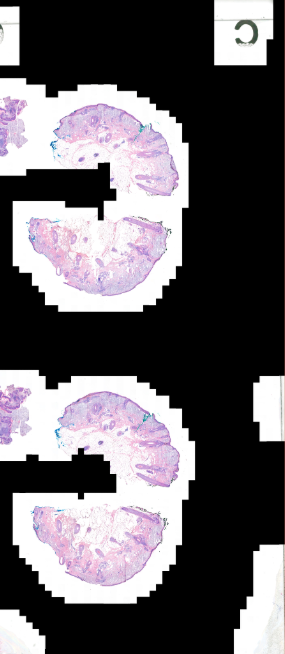
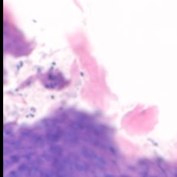
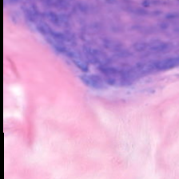
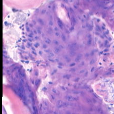
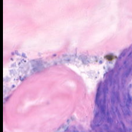
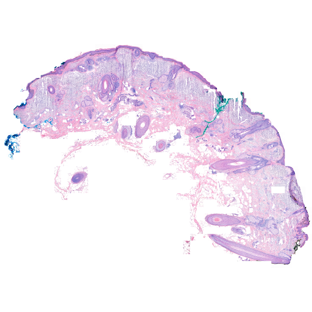
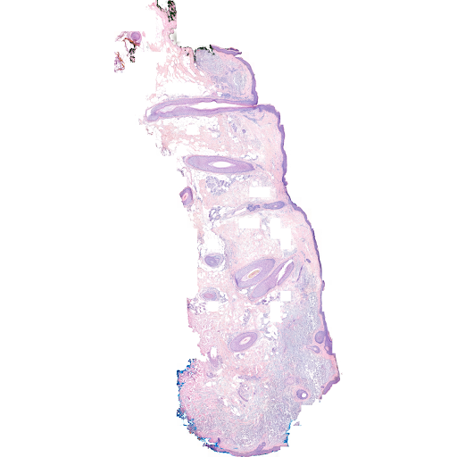

# GatorVision
GatorVision is an AI-powered histology image classifier. It aims to develop a software tool that uses deep learning to classify images of skin tissue as either cancerous or non-cancerous. Utilizing convolutional neural networks (CNNs), this software will assist dermatologists by providing rapid preliminary diagnoses, enhancing the speed and accuracy of skin cancer detection.
## Training
Currently, the model has been trained on a few thousand BCC images. The goal is to have the model trained on SCC images as well.
## Process
First, the whole slide image is processed and split into much smaller 224x224 tissue-containing regions. Then, these regions are parsed, removing any extraneous elements such as the background. Finally, they are reassembled, and the model scans this reassembled image.
## Tools and Libraries
- [TensorFlow](https://www.tensorflow.org/)
- [OpenCV](https://opencv.org/)
- [Jupyter](https://jupyter.org/)
- Python 3.x
## Contributing
If you'd like to contribute, clone this repository by running:
`git clone https://github.com/tannergarcia/AI-Powered-Histology-Image-Classification`
## Development
This application is built using [React](https://react.dev/).

To get started, in the project directory, run:
`npm start`

Opening [http://localhost:3000](http://localhost:3000) will allow you to view and interact with the application.
## Examples
Here is an example of a whole slide image, followed by a few of the corresponding tissue-containing regions:

Here are some of the parsed images:
Cancer detected (present): 
No cancer detected (clear): 
